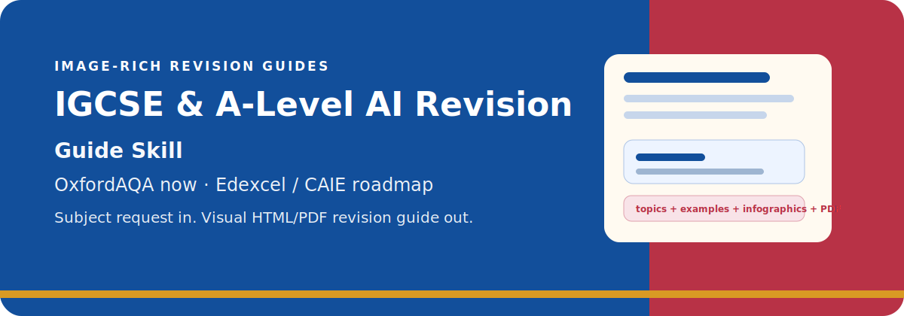
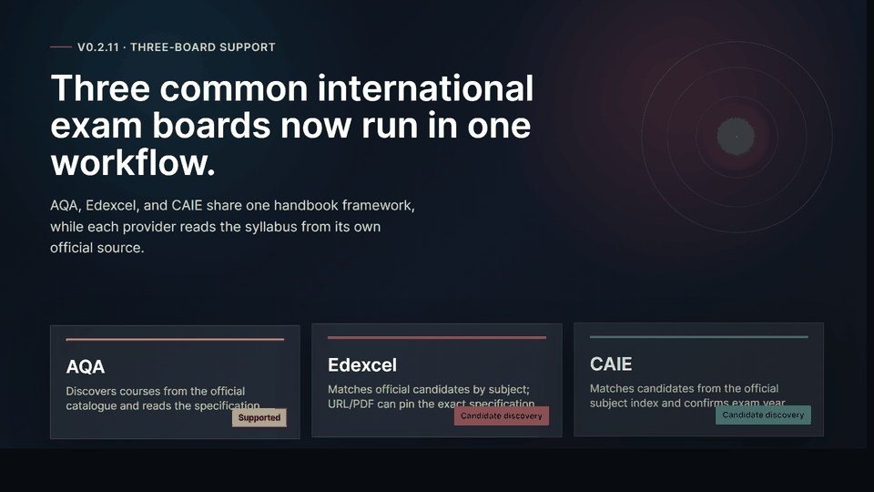
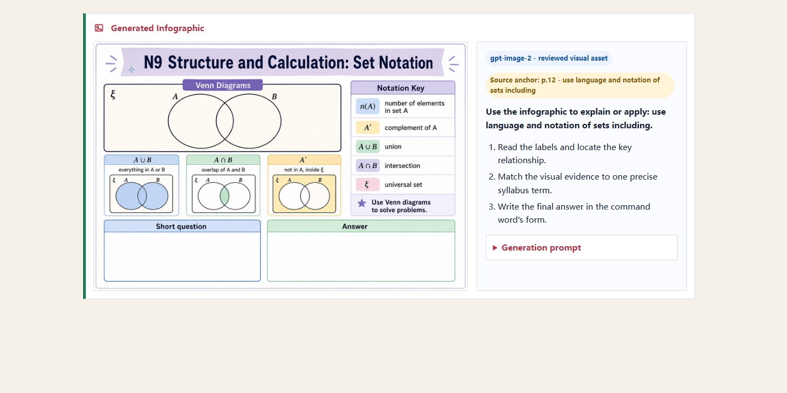
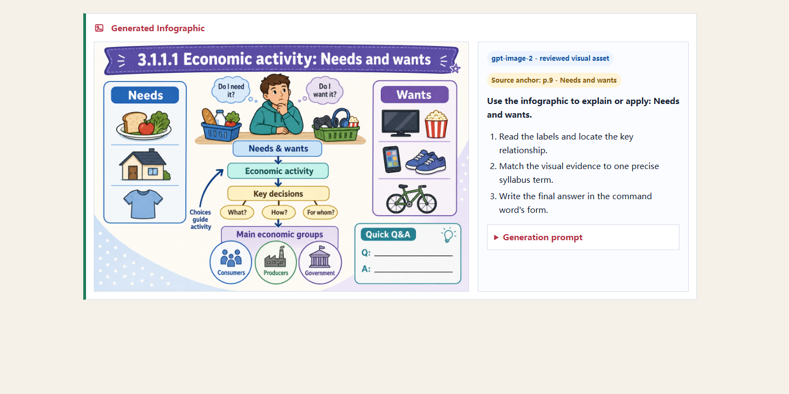
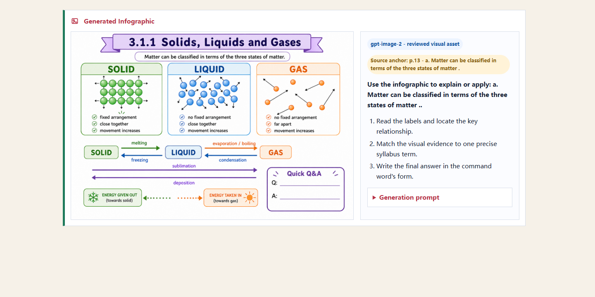

# IGCSE & A-Level AI Revision Guide Skill

<p align="center">
  
</p>

## Why This Skill Exists

This project began at home. My son is taking his International GCSE exams this
year after moving from a Chinese public-school path into an international
curriculum. In less than a year, the classroom language shifted from Chinese to
English, while the exam clock kept moving.

I used AI to build a study and revision Skill: take the course requirements,
break knowledge into understandable structures, worked examples, diagrams, and
checkpoints. The goal is not to let AI learn for a child. The goal is to lower
the noise around learning so students can face schoolwork with more calm and
control.

<p align="center">
  <a href="https://mianbaofang.github.io/igcse-a-level-revision-guide/project-intro-animation-en.html">
    
  </a>
</p>

<p align="center">
  <a href="README.zh-CN.md">中文 README</a>
  ·
  <a href="https://mianbaofang.github.io/igcse-a-level-revision-guide/">Project site</a>
  ·
  <a href="https://mianbaofang.github.io/igcse-a-level-revision-guide/project-intro-animation-en.html">HTML intro</a>
  ·
  <a href="docs/PROJECT_DETAILS.md">Project details</a>
  ·
  <a href="docs/PROJECT_OPERATIONS.md">Operations guide</a>
  ·
  <a href="docs/IMAGE_MODEL_GUIDE.md">Image guidance</a>
</p>

An AI Skill for generating image-rich, printable International GCSE and
International AS-A-level revision handbooks from official exam-board sources.

This version is built around the three exam boards most relevant to mainland
China international-school usage:

| Exam board | Current support |
|---|---|
| AQA | Discovers qualifications from OxfordAQA / Oxford International AQA public pages and reads the public specification PDF. |
| Edexcel | Tries official Pearson Edexcel subject-page candidates from the subject name; falls back to a supplied official subject page or direct specification PDF URL. |
| CAIE | Searches official Cambridge International subject indexes for candidates; falls back to a supplied official subject page or direct syllabus PDF URL; asks for the exam year when several ranges are listed. |

It uses one shared handbook workflow across the three boards: read the official
syllabus, expand it into teachable topic units, create worked examples, decide
which points need visuals, and deliver HTML/PDF output.

## Quick Start

Most users do not need to install Python or run commands. Give this Skill link
to your OpenClaw, Hermes, or other Skill-compatible Agent:

```text
https://github.com/mianbaofang/igcse-a-level-revision-guide/tree/main/skill
```

Then ask:

```text
Install this Skill, then generate a Chinese AQA Chemistry International GCSE revision handbook and export it as PDF.
```

Typical requests:

```text
Generate an Edexcel Accounting International GCSE revision guide.
Generate a Chinese Cambridge IGCSE Economics guide for the 2027 exam year.
Generate an AQA Mathematics 9260 revision handbook with visual worked examples and final review questions.
```

Before generation starts, the Agent should confirm:

1. Exam board, qualification level, subject, code, and official URL when needed.
2. Exam year when the official page lists multiple syllabus ranges.
3. Output language: English or Chinese. Student-facing labels, examples, and
   visual prompts use one language only.
4. Explanation style: formal, friendly, life-scene, story-based, detective, or
   adventure-style.

The user should not be forced to choose an image model at the beginning. The
base handbook is generated first. After that, the Agent reports how many complex
infographics are needed. If the user has a callable image API, image-generation
Skill, script, or generated asset directory, the Agent should run that route and
then import or attach the reviewed images automatically. Otherwise, the package
uses SVG fallback drafts and clearly marks complex visuals for review.

## What It Produces

```text
outputs/chemistry-9202/
  guide.html                 printable student handbook
  guide.pdf                  PDF export
  sections/                  modular guide sections for review
  images/                    SVG drafts, infographic assets, and visual manifest
  run-options.json           confirmed subject, language, and explanation style
  guide-plan.json            topic, example, and revision-task plan
  qualification.json         qualification and source metadata
  validation.json            quality-check report
  handbook-package.json      final delivery manifest
```

The handbook package includes:

- syllabus-based topic structure;
- student-friendly explanations;
- original worked examples with steps and answer checkpoints;
- visual-learning decisions for topics and examples;
- simple SVG diagrams and pending complex-infographic briefs;
- final revision questions;
- printable HTML/PDF output.

## Preview

| Mathematics | Economics | Chemistry |
|---|---|---|
|  |  |  |

These screenshots demonstrate handbook quality. They are not the subject limit.

## Supported Exam Boards

| Exam board | International GCSE | International AS-A-level | Current behavior |
|---|---:|---:|---|
| AQA | yes | yes | Public catalogue discovery through OxfordAQA / Oxford International AQA pages. |
| Edexcel | yes | yes | Subject-name candidate discovery for common official Pearson Edexcel page patterns; official URL/PDF can override ambiguity. |
| CAIE | yes | yes | Official Cambridge International subject-index candidate discovery; official URL/PDF can override ambiguity; exam year is required for multi-range pages. |
| OCR, WJEC/Eduqas, CCEA, and other UK boards | no | no | Outside the current release scope. |

The current release focuses on AQA, Edexcel, and CAIE. Full official names are
OxfordAQA / Oxford International AQA, Pearson Edexcel, and Cambridge
International. It does not claim support for every UK A-level awarding
organisation.

## Visuals And Writing Styles

A useful handbook cannot be text-only. The workflow has two passes:

1. Build topic explanations and worked examples from the official syllabus.
2. Decide which topics or examples need visual explanation.

Simple reproducible diagrams use SVG. More complex items become visual briefs:
lab apparatus, geometry diagrams, circuits, economics charts, or text-heavy
educational infographics.

When no callable image model is available, chart-like visuals use a scripted
scientific-vector fallback inspired by `nature-figure`: editable SVG with clear
axes, labels, source-bound symbols, and review notes. It is not a substitute for
dense infographics; those remain queued until a reviewed image asset is supplied.

Recommended external image models include:

- OpenAI GPT Image 2.0;
- Qwen Image 2.0 Pro;
- SenseNova U1 Fast.

These are recommendations, not guaranteed built-in capabilities. Users need to
provide their own callable API, Skill, script, or generated image assets. Images
explain selected syllabus points; they must not introduce unsupported exam
claims.

Writing styles include formal exam prep, friendly explanation, life-scene
analogy, story-based teaching, detective reasoning, and adventure-style study
missions. The default is original framing, not copied protected characters or
worlds.

The writing pass also includes a small anti-template-language gate adapted from
the anti-AI-language ideas in `qiaomu-novel-generator`: it removes safe
formulaic transitions and warns when a guide still sounds like generic AI prose.
This is a design inspiration, not a runtime dependency.

Design inspirations: the anti-template wording check is adapted from
`qiaomu-novel-generator`; the scientific SVG fallback is inspired by the
`nature-figure` figure-contract idea from
[`Yuan1z0825/nature-skills`](https://github.com/Yuan1z0825/nature-skills).
Both have been reshaped for revision handbooks.

## Language Policy

The output language is chosen before generation:

- English mode keeps student-facing text, labels, examples, and visual prompts in English.
- Chinese mode keeps student-facing text, labels, examples, and visual prompts in Simplified Chinese.
- The generator should not create bilingual `Chinese / English` labels.
- Official English terms can stay in source files or a review appendix, but the student-facing handbook should remain in one language.

## Core Changes Since v0.1.0

README only summarizes changes that affect the Skill's actual generation flow.
See [CHANGELOG.md](CHANGELOG.md) for the complete history.

- **v0.2.0:** expanded the project from an AQA-focused flow to a three-board
  framework for AQA, Edexcel, and CAIE; added language lock, post-handbook image
  routing, SVG fallback warnings, and cross-subject regression samples.
- **v0.2.1:** fixed real handbook regressions found during Accounting and
  Economics runs, including Chinese terminology, Accounting display names,
  generated raster assets, PDF export timeout, and validation coverage.
- **v0.2.2:** tightened Skill gates after review: confirm subject/year/language
  and style before generation, return Edexcel/CAIE candidates instead of
  guessing, and avoid presenting scratch candidate checks as final handbooks.
- **v0.2.7:** cleaned public docs so a GitHub clone has no private local paths,
  removed a duplicate CLI resolver, and tightened validation for Chinese
  placeholders plus duplicate practice questions.
- **v0.2.8:** hardened the generation engine: unified provider fetching, added
  Pearson Edexcel learning-table parsing, made PDF export prefer Playwright with
  Chrome/Edge fallback, added CLI `discover`/`generate` coverage, and added
  validation gates for generic `Content unit` topics or missing assessment
  extraction.
- **v0.2.9:** closes the remaining audit gaps: CI now runs an OS/Python matrix
  with coverage, visual routing has cross-subject benchmarks, Physics force and
  motion routes to infographic briefs, SVG substring collisions are fixed, and
  the HTML renderer is split into structure, SVG templates, and CSS modules.
- **v0.2.10:** fixes real second-round audit regressions: Edexcel no longer
  appends Pearson front matter into topics, CAIE skips content-overview and AO
  tables, Chinese handbook titles avoid generic numbered placeholders, generated
  HTML gains quick navigation and width constraints, and SVG fallbacks now use
  subject-specific accounting, economics, maths, physics, and chemistry
  templates.
- **v0.2.11:** clarifies validation output for visual assets: generated raster
  infographics, SVG fallback assets, and pending infographic briefs are now
  counted separately so prompt-queue runs are not mistaken for missing visuals.
- **v0.2.12:** cleans up Skill/project wording so image generation is presented
  as a post-handbook review step, not a required preflight model choice, and
  keeps the explanation diagrams aligned with the AQA, Edexcel, and CAIE flow.
- **v0.2.13:** redesigns the generated handbook's opening pages: the cover now
  focuses on exam-board/course identity, the setup page avoids internal
  engineering wording, and the roadmap table removes the extra study-route
  column.
- **v0.2.14:** completes the actionable third-round audit follow-up: splits the
  planning monolith, adds mypy and Codecov coverage upload to CI, strengthens
  Pearson/Cambridge parser tests, covers encrypted PDF handling, and makes
  narrative explanation cards topic-aware. Built-in image models remain out of
  scope by design.
- **v0.2.15:** finishes the third-round audit cleanup by removing the local
  image-router script from the public repo, documenting external reviewed asset
  import as the release path, and adding direct regression tests for guide-plan
  behavior, provider PDF selection, PDF export errors, and topic-aware story
  cards.
- **v0.2.16:** clarifies the image workflow after user testing: external image
  generation is not a manual file-moving step. If the user has a callable image
  Skill, API, script, or generated asset directory, the Agent should run or
  import that route automatically after the base handbook is generated.
- **v0.2.17:** adds the anti-template language gate to generated explanations
  and practice cards, plus validation warnings for remaining formulaic AI-style
  wording. The homepage and README now credit the anti-AI-language and
  nature-figure inspirations as design references, not runtime dependencies.
- **v0.2.18:** completes the fourth-round audit hardening: infographic rendering
  is split out of the main HTML renderer, practice generation reuses the shared
  subject matcher, assessment duration/weighting parsing is fixed, direct
  practice/parser tests are added, and CI now enforces 70% coverage.
- **v0.2.19:** fixes fifth-round audit regressions: unknown/demo sources no
  longer display AQA branding, anti-template wording detection covers more
  English and Chinese AI-style phrases, and direct tests now cover infographic
  rendering branches plus Mathematics/Biology/Economics practice examples.
- **v0.2.20:** closes the sixth-round audit loop by centralizing rendered icons,
  blocking stale ignored `outputs/` from being used as release evidence,
  tightening the practice-generator architecture guard, and expanding direct
  tests for multi-subject practice generation plus PDF export branches.
- **v0.2.21:** closes the eighth-round testing-coverage gap: direct renderer
  contract tests now cover handbook cover identity, stylesheet/print layout,
  visual manifest handling, generated raster reuse, SVG fallback assets, modular
  package output, and the Playwright Chrome-to-Edge PDF fallback path.
- **v0.2.22:** closes the ninth-round rendering coverage gap: `html.py`
  now has direct contract tests for the full HTML entry point, `render_topics()`,
  guide cards, concept diagrams, story-mode blocks, practice cards, visual
  example routing, source appendix, assessment fallback, navigation, and topic
  title localization.
- **v0.2.23:** closes the tenth-round P3 audit items: weak truthy assertions are
  now exact-value checks, `zh-CN` rendering paths have direct contracts, fresh
  demo evidence is restored for the release, and `svg_templates.py` plus
  `text.py` now have dedicated tests.
- **v0.2.24:** closes the eleventh-round P3 follow-up: explanation-style and
  localization helpers now have dedicated tests, `zh-CN` HTML helper branches
  and `render_html()` have direct coverage, SVG text edge cases are covered,
  raw-key release scans match the checklist, and the unused Chinese branch in
  the English concept fallback SVG was removed.
- **v0.2.25:** closes the twelfth-round precision pass: Chinese localization
  and explanation-style tests now assert exact input-to-output mappings,
  `zh_visual_type()` has dedicated route coverage, and the public intro
  animation labels are guarded against drifting behind the package version.
- **v0.2.26:** closes the thirteenth-round audit follow-up by adding dedicated
  `subject_profiles.py` and `validation/checks.py` tests, tightening
  `zh_topic_reference()` and `zh_visual_type()` route assertions, and making the
  animation version guard reject any stale `v0.2.x` label.

## Developer Quick Start

Normal Skill users can skip this section.

```bash
python -m venv .venv
source .venv/bin/activate
pip install -e .
python -m intl_exam_guide generate --query chemistry --level igcse --language en --explanation-style friendly --out ./outputs/chemistry-9202
```

Windows PowerShell:

```powershell
python -m venv .venv
.\.venv\Scripts\Activate.ps1
pip install -e .
python -m intl_exam_guide generate --query chemistry --level igcse --language en --explanation-style friendly --out .\outputs\chemistry-9202
```

Checks:

```bash
python -m pytest --cov --cov-report=term-missing --cov-fail-under=70 -q
python -m ruff check .
python -m compileall -q src tests scripts
python scripts/scan_for_raw_keys.py . ./outputs
```

## Repository Layout

```text
src/intl_exam_guide/
  providers/      exam-board source access and parsing
  parsing/        PDF text extraction
  planning/       topic, example, and visual-brief planning
  rendering/      HTML and PDF rendering
  validation/     completeness checks
skill/            Agent-facing Skill instructions
docs/             project details, policies, examples, and preview pages
tests/            tests and regression samples
```

## Copyright And Source Policy

Do not commit downloaded official PDFs, past papers, mark schemes, or copied exam
questions. Public samples should use original explanations, original practice
cards, and the minimum source information needed for review.

Families should have subject teachers or syllabus-aware adults review deeper
worked examples before using generated guides as final exam preparation.

## License

MIT.
