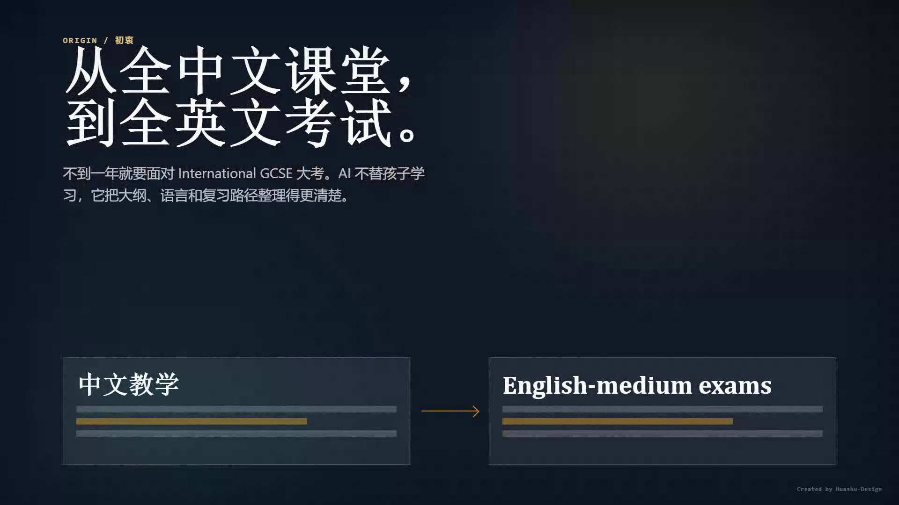
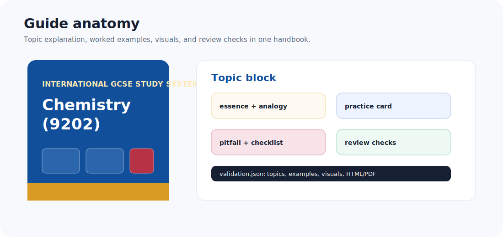
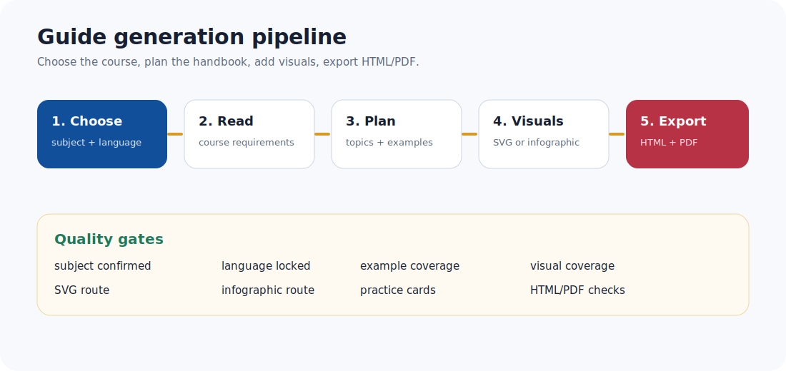

# International Exam Guide

<p align="center">
  
</p>

<p align="center">
  <a href="README.md">English README</a>
  ·
  <a href="docs/index.html">项目主页</a>
  ·
  <a href="docs/project-intro-animation.html">介绍动画</a>
  ·
  <a href="docs/PROJECT_DETAILS.md">项目详情</a>
  ·
  <a href="docs/SKILL_EXPLAINED.md">Skill 图解</a>
  ·
  <a href="docs/EXAMPLES.md">示例</a>
  ·
  <a href="docs/ACCURACY_POLICY.md">准确性政策</a>
  ·
  <a href="docs/RELEASE_CHECKLIST.md">发布清单</a>
</p>

<p align="center">
  
  
  
  
</p>

International Exam Guide 是一个 Codex Skill，用来生成可追溯来源、可打印的
OxfordAQA International GCSE 与 International AS/A-level 复习手册。

如果你是家长、学生、老师或辅导老师，不需要自己安装 Python，也不需要看懂代码。
把下面的 Skill 链接发给 Codex/Agent，让它安装；之后你只要用普通中文说
“帮我生成某个科目的复习手册”，Agent 就会自动下载官方大纲、生成 HTML/PDF，
并检查输出是否完整。

## 普通用户从这里开始

把这个链接发给你的 Codex/Agent：

```text
https://github.com/ethanzhangliang-creator/international-exam-guide/tree/main/skill
```

然后说：

```text
请安装这个 Skill，然后帮我生成 OxfordAQA Chemistry International GCSE 复习手册，并导出 PDF。
```

安装好以后，直接这样提需求就可以：

```text
帮我生成 OxfordAQA Biology International GCSE 学习手册。
帮我生成 Chemistry 9202 复习手册，并导出 PDF。
帮我生成 OxfordAQA Business International AS/A-level revision guide。
```

Agent 会根据 Skill 自动找到 OxfordAQA 公开 qualification 页面，下载公开
course specification PDF，抽取 syllabus 和考试结构，为 topic 匹配 PDF
页码级 source snippets，并生成带知识地图、例题框架、练习卡、答案检查点和
validation report 的 HTML/PDF 学习指南。

当前范围故意保持清楚：现在只实现 OxfordAQA。后续路线图只优先扩国内常用场景中的
Pearson Edexcel 与 Cambridge International / CAIE。

## 24 秒介绍动画

<p align="center">
  <a href="docs/project-intro-animation.html">
    
  </a>
</p>

<p align="center">
  <a href="docs/project-intro-animation.html">打开 HTML 介绍动画</a>
  ·
  <a href="docs/project-intro-animation.mp4">播放或下载 MP4</a>
  ·
  <a href="docs/index.html">打开项目主页</a>
</p>

## 为什么要做这个工具

这个项目最早不是为了做一个“工具”，而是为了帮一个真实的孩子轻一点地走过
转轨期。我的儿子今年要参加 International GCSE 大考；他从公办体系转到国际
课程还不到一年，课堂语言几乎一下从全中文切换到全英文。知识点本身可以慢慢
学，但新的语言、新的考试方式和临近大考的时间压力叠在一起，很容易让孩子
觉得自己被推着走。

于是我开始把 AI 做成一个复习 Skill：让它先读官方大纲，再把知识点拆成能
理解的结构、例题和检查点。这个项目的初衷很简单：不是替孩子学习，而是把
学习路上的噪音降下来，利用人工智能帮助孩子更轻松、更有掌控感地面对学业。

因此，这个项目的原则是：

> 学习指南中的 syllabus 事实，必须能追溯到公开 qualification 页面或下载的大纲 PDF。

它不是普通 AI 总结器，也不是题库搬运器，而是一个 source-traceable
revision guide generator。

## 适合谁

OxfordAQA International GCSE 面向在英国以外、跟随 British curriculum 的
international students 和 international schools。OxfordAQA 网站也提示，
不同地区、学校、考点可能存在科目可用性和报名路径差异，所以生成的指南会提示
家庭向学校或 exam centre 确认本地考试安排。

International GCSE 通常是 linear qualification，也就是课程结束时同一考季完成考试。
International AS/A-level 通常是 modular qualification，也就是按 unit 组织。
本工具会区分这两种结构。

## 效果预览

| 生成指南结构 | 生成流水线 |
|---|---|
|  |  |

## 开发者快速开始

这一节只给想修改 Python 引擎或二次开发的人看。普通 Skill 用户可以跳过。

先运行离线 synthetic demo：

```bash
python -m venv .venv
source .venv/bin/activate
pip install -e .
python -m intl_exam_guide demo --out ./outputs/demo-science --skip-pdf
```

再运行真实 OxfordAQA 公开 qualification：

```bash
python -m intl_exam_guide generate --query chemistry --level igcse --out ./outputs/chemistry-9202
```

Windows PowerShell:

```powershell
python -m venv .venv
.\.venv\Scripts\Activate.ps1
pip install -e .
python -m intl_exam_guide demo --out .\outputs\demo-science --skip-pdf
python -m intl_exam_guide generate --query chemistry --level igcse --out .\outputs\chemistry-9202
```

不安装，直接从源码运行：

```bash
PYTHONPATH=src python -m intl_exam_guide generate --query chemistry --level a-level --out ./outputs/chemistry-9620
```

## 会生成什么

```text
outputs/chemistry-9202/
  guide.html                 可打印学习指南
  guide.pdf                  PDF 导出
  guide-plan.json            结构化学习计划与练习卡片
  qualification.json         抽取出的 qualification 元数据
  validation.json            质量检查报告
  source/
    oxfordaqa-9202-specification.pdf   运行时下载，不应提交到仓库
    oxfordaqa-9202-specification.txt   抽取文本，不应提交到仓库
```

## 当前能力

| Provider / exam board | International GCSE | International AS/A-level | 状态 |
|---|---:|---:|---|
| OxfordAQA / Oxford International AQA Examinations | 支持 | 支持 | MVP 已实现 |
| Pearson Edexcel | 计划支持 | 计划支持 | 国内市场路线图 |
| Cambridge International / CAIE | 计划支持 | 计划支持 | 国内市场路线图 |
| 其他英国考试局，包括 OCR、WJEC/Eduqas、CCEA | 不支持 | 不支持 | 不在当前范围内 |

也就是说，当前代码是 OxfordAQA provider，不是泛称 AQA 全部英国本土体系，
也不是一次性覆盖所有 A-level awarding organisations。开源版本先把
OxfordAQA 做稳，再按国内可用场景扩 Pearson Edexcel 和 Cambridge
International / CAIE。

在 OxfordAQA subject 页面里，工具也会记录网站分组来源：
`btn--type-8` 视为蓝色 International GCSE listing，
`btn--type-7` 视为红色 International AS/A-level listing。这个信息会写入
`qualification.json`，并显示在生成指南的来源说明中。

当前 discovery audit 已发现 17 个 subject pages、48 个 qualification links：
31 个 International GCSE listings、17 个 International AS/A-level listings，
没有 unknown 类型。

解析器审计也打开了全部 48 个 qualification pages：没有缺 topic、没有缺
assessment structure、没有缺 specification link，也没有蓝色/红色 listing 与
qualification type 的冲突。

当前范围参考的官方入口：

- [OxfordAQA](https://www.oxfordaqa.com/)：当前已实现 provider，来源为其
  International GCSE / International AS/A-level 公开页面。
- [Pearson Edexcel International Advanced Levels](https://qualifications.pearson.com/en/qualifications/edexcel-international-advanced-levels.html)：
  后续 Pearson provider 的官方入口之一。
- [Cambridge International facts and figures](https://www.cambridgeinternational.org/about-us/facts-and-figures/)：
  后续 Cambridge International / CAIE provider 的官方背景入口之一。

## 语言策略

生成指南会有意采用中英混排，但规则必须清楚：

- 官方 qualification title、topic title、paper title、syllabus points 和
  source snippets 保留 OxfordAQA 英文原文。
- 模板导航标签统一双语，中文在前、英文在后，例如 `知识地图 / Knowledge Map`。
- 中文 topic 翻译只能来自人工审核过的 glossary 或学科老师复核后的 authoring pass。

这样做是为了避免自动生成看起来顺眼、但术语不准的中文大纲标题。

## 准确性设计

工具分成六层：

1. **发现**：找到公开 qualification 页面与 specification PDF 链接。
2. **抽取**：下载 PDF，抽取页码文本，解析 topic 和 assessment。
3. **来源匹配**：给每个 topic 匹配 PDF 页码级 source snippets。
4. **指南规划**：生成 topic essence、类比、mini worked example、diagram brief 和 practice cards。
5. **图解渲染**：用 syllabus points 生成确定性 SVG concept maps。
6. **校验**：检查 source、topic、assessment、diagram、guide block、HTML/PDF 是否完整。

当前的 practice cards 是来源绑定的练习卡片，不复制真题，也不编造完整数值答案。
每张卡片会记录 command word、difficulty、focus point、public solution steps
和 answer checkpoints。未来如果接入 LLM 深度生成题目，必须引用抽取出的
source snippets，并通过审核。

`validation.json` 不只包含 issues，也包含 `review_summary`：topic 数量、
practice card 数量、diagram 数量、PDF source snippet 覆盖、网站 listing 元数据、
audience note 是否说明 international students / outside UK 等都会列出来。

## CLI 用法

列出 subject pages：

```bash
python -m intl_exam_guide discover
```

列出某个 subject 下的 qualifications：

```bash
python -m intl_exam_guide discover --subject-url https://www.oxfordaqa.com/subjects/science/
```

输出为 tab 分隔列：

```text
title    qualification_type    subject_heading    website_group    url
```

生成 International GCSE 指南：

```bash
python -m intl_exam_guide generate --query chemistry --level igcse --out ./outputs/chemistry-9202
```

生成离线 demo：

```bash
python -m intl_exam_guide demo --out ./outputs/demo-science --skip-pdf
```

生成 International AS/A-level 指南：

```bash
python -m intl_exam_guide generate --query chemistry --level a-level --out ./outputs/chemistry-9620
```

生成非 Science 的 International GCSE 指南：

```bash
python -m intl_exam_guide generate --query economics --level igcse --out ./outputs/economics-9214
```

用考试代码生成非 Science 的修订版 International AS/A-level 指南：

```bash
python -m intl_exam_guide generate --query 9725 --level a-level --out ./outputs/business-9725
```

没有浏览器运行环境时跳过 PDF：

```bash
python -m intl_exam_guide generate --query 9202 --level igcse --out ./outputs/chemistry-9202 --skip-pdf
```

## Codex Skill

仓库内置 `skill/` 目录，可以作为 Codex skill 使用。

<p align="center">
  
</p>

Skill 保持简洁，只描述 agent 什么时候使用、如何运行 CLI、如何检查输出；
稳定、容易出错的步骤交给 Python 包执行。详见
[Skill 图解说明](docs/SKILL_EXPLAINED.md)。

## 版权与来源政策

不要把下载的 OxfordAQA PDFs、past papers、mark schemes 或复制来的题目内容提交到仓库。
工具会在运行时下载公开 specification，记录 URL、hash 和生成时间，并生成原创的学习指南框架与练习卡片。

给孩子正式使用前，应由学科老师或熟悉大纲的人复核深度例题和答案。

## 开发

```bash
pip install -e ".[dev]"
python -m pytest
python -m compileall -q src tests
```

## 目录结构

```text
src/intl_exam_guide/
  providers/      网站发现与页面解析
  parsing/        PDF 文本抽取
  planning/       来源安全的学习指南规划
  rendering/      HTML 与 PDF 渲染
  validation/     完整性与安全性检查
skill/            Codex skill wrapper
docs/             项目详情、skill 图解、准确性政策、调研记录
tests/            parser 与 pipeline 测试
```

## License

MIT.
