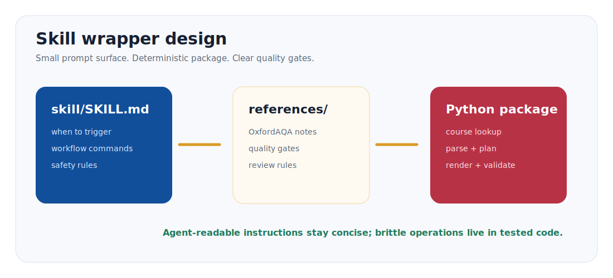

# International Exam Guide

<p align="center">
  
</p>

<p align="center">
  <a href="README.md">English README</a>
  ·
  <a href="https://ethanzhangliang-creator.github.io/international-exam-guide/">项目主页</a>
  ·
  <a href="https://ethanzhangliang-creator.github.io/international-exam-guide/project-intro-animation.html">介绍动画</a>
  ·
  <a href="docs/PROJECT_DETAILS.md">项目详情</a>
  ·
  <a href="docs/SKILL_EXPLAINED.md">Skill 图解</a>
  ·
  <a href="docs/IMAGE_MODEL_GUIDE.md">生图模型</a>
  ·
  <a href="docs/EXAMPLES.md">示例</a>
  ·
  <a href="docs/ACCURACY_POLICY.md">准确性政策</a>
  ·
  <a href="docs/RELEASE_CHECKLIST.md">发布清单</a>
</p>

<p align="center">
  
  
  
  
</p>

International Exam Guide 是一个 Codex Skill，用来把 OxfordAQA
International GCSE 或 International AS-A-level 科目变成图文并茂、可打印的
学习/复习手册。

如果你是家长、学生、老师或辅导老师，不需要自己安装 Python，也不需要看懂代码。
把下面的 Skill 链接发给 Codex/Agent，让它安装；之后你只要用普通中文说
“帮我生成某个科目的复习手册”。确认科目、输出语言、生图模型和讲解风格后，
Agent 会返回包含知识点讲解、例题、信息图、复习题的 HTML/PDF 手册。

## 普通用户从这里开始

把这个链接发给你的 Codex/Agent：

```text
https://github.com/ethanzhangliang-creator/international-exam-guide/tree/main/skill
```

然后说：

```text
请安装这个 Skill，然后帮我生成 OxfordAQA Chemistry International GCSE 复习手册，并导出 PDF。
```

安装好以后，直接这样提需求就可以：

```text
帮我生成 OxfordAQA Biology International GCSE 学习手册。
帮我生成 Chemistry 9202 复习手册，并导出 PDF。
帮我生成 OxfordAQA Business International AS-A-level revision guide。
```

真正开始生成前，Agent 会先让你确认四件事：

1. **科目**：考试局、阶段、科目、代码，例如 OxfordAQA International GCSE Chemistry 9202。
2. **输出语言**：选择英文 `en` 或简体中文 `zh-CN`。手册自己的标题、讲解、
   图片提示词和例题外框会使用一种语言，不再做 `中文 / English` 双语标签。
3. **信息图生图方式**：选择 `gpt-image-2`、`qwen-image-pro`、
   `sensenova-u1-fast`、`custom`，或者明确选择只做 `prompt-queue` dry run。
   如果用自己的模型/API，只需要提供模型名、接口 URL、API key 所在的环境变量名；
   不要把真实 key 发到聊天或提交到仓库。
4. **讲解风格**：`formal` 正经严谨、`friendly` 轻松愉快、`life` 生活场景、
   `story` 故事性强、`detective` 侦探推理、`adventure` 原创闯关感。

这四项确认完以后，Agent 才会根据 Skill 开始真正生成：围绕所选 OxfordAQA
课程要求整理知识点和例题，判断哪些内容需要图文结合讲解，选择 SVG 或信息图模型生成图片，
最后输出带知识地图、例题、练习卡、答案检查点和复习题的 HTML/PDF 学习指南。

当前范围故意保持清楚：现在只实现 OxfordAQA。后续路线图只优先扩国内常用场景中的
Pearson Edexcel 与 Cambridge International / CAIE。

## 24 秒介绍动画

<p align="center">
  <a href="https://ethanzhangliang-creator.github.io/international-exam-guide/project-intro-animation.html">
    
  </a>
</p>

<p align="center">
  <a href="https://ethanzhangliang-creator.github.io/international-exam-guide/project-intro-animation.html">打开可播放 HTML 介绍动画</a>
  ·
  <a href="https://ethanzhangliang-creator.github.io/international-exam-guide/project-intro-animation.mp4">播放或下载 MP4</a>
  ·
  <a href="https://ethanzhangliang-creator.github.io/international-exam-guide/">打开项目主页</a>
</p>

## 为什么要做这个工具

这个项目最早不是为了做一个“工具”，而是为了帮一个真实的孩子轻一点地走过
转轨期。我的儿子今年要参加 International GCSE 大考；他从公办体系转到国际
课程还不到一年，课堂语言几乎一下从全中文切换到全英文。知识点本身可以慢慢
学，但新的语言、新的考试方式和临近大考的时间压力叠在一起，很容易让孩子
觉得自己被推着走。

我用 Codex 做了一个学习、复习用的 Skill：让它围绕对应课程要求，把知识点拆成能
理解的结构、例题、图解和检查点。这个项目的初衷很简单：不是替孩子学习，而是把
学习路上的噪音降下来，利用人工智能帮助孩子更轻松、更有掌控感地面对学业。

这个项目的承诺很简单：让复习变得更好读、更有画面、更容易检查。官方大纲和校验
机制放在后台作为安全栏，避免手册为了“看起来丰富”而跑偏。

## 适合谁

OxfordAQA International GCSE 面向在英国以外、跟随 British curriculum 的
international students 和 international schools。OxfordAQA 网站也提示，
不同地区、学校、考点可能存在科目可用性和报名路径差异，所以生成的指南会提示
家庭向学校或 exam centre 确认本地考试安排。

International GCSE 通常是 linear qualification，也就是课程结束时同一考季完成考试。
International AS-A-level 通常是 modular qualification，也就是按 unit 组织。
本工具会区分这两种结构。

## 效果预览

| Mathematics | Economics | Chemistry |
|---|---|---|
|  |  |  |

## 图文与讲解风格

手册不能像 syllabus 摘录一样催眠。现在的渲染层分三层：

- **确定性 SVG 基础图**：概念地图、粒子模型、pH 标尺、能量曲线等可复现图形。
- **用户选择的信息图生图模型**：复杂几何、实验装置、电路、经济学图表、
  以及按所选输出语言生成的文字信息图。
- **叙事讲解模板**：生活场景、侦探推理、动漫闯关感等讲法。默认使用原创表达，
  不直接复刻受保护角色或世界观。

AI 会分析哪些知识点和例题需要图文结合讲解。被选中的条目会生成 `visual_brief`：
需要什么图、SVG 是否足够、如果需要信息图则
用户选择哪个生图模型，以及用于生成图表的 prompt queue。

## 可选生图能力

当前 MVP 对简单视觉需求使用确定性 SVG 草图。如果 AI 判断某个知识点需要实验装置图、
结构示意图、流程图、单语言信息图或复杂视觉解释，agent 应先让用户选择 image
provider，再生成复杂图表。

推荐起点：

- **OpenAI `gpt-image-2`**：有 OpenAI / Codex 环境时作为高质量选项。
- **Qwen-Image-2.0 / Qwen Image 2.0 Pro**：适合中文/英文文字较多的信息图实验。
- **SenseNova U1 / SenseNova-U1-8B-MoT variants**：适合开源、本地或快速信息图实验。

详见 [生图模型建议](docs/IMAGE_MODEL_GUIDE.md)。生图只负责解释选中的知识点，
不能额外编出考试结论或不受支持的事实。

## 开发者快速开始

这一节只给想修改 Python 引擎或二次开发的人看。普通 Skill 用户可以跳过。

先运行离线 synthetic demo：

```bash
python -m venv .venv
source .venv/bin/activate
pip install -e .
python -m intl_exam_guide demo --out ./outputs/demo-science --language en --image-provider deterministic-svg --explanation-style friendly --skip-pdf
```

再运行真实 OxfordAQA 公开 qualification：

```bash
python -m intl_exam_guide generate --query chemistry --level igcse --language en --image-provider qwen-image-pro --explanation-style friendly --out ./outputs/chemistry-9202
```

Windows PowerShell:

```powershell
python -m venv .venv
.\.venv\Scripts\Activate.ps1
pip install -e .
python -m intl_exam_guide demo --out .\outputs\demo-science --language en --image-provider deterministic-svg --explanation-style friendly --skip-pdf
python -m intl_exam_guide generate --query chemistry --level igcse --language en --image-provider qwen-image-pro --explanation-style friendly --out .\outputs\chemistry-9202
```

不安装，直接从源码运行：

```bash
PYTHONPATH=src python -m intl_exam_guide generate --query chemistry --level a-level --language en --image-provider prompt-queue --explanation-style detective --out ./outputs/chemistry-9620
```

## 会生成什么

```text
outputs/chemistry-9202/
  guide.html                 可打印学习指南
  guide.pdf                  PDF 导出
  sections/                  模块化手册源码片段，便于 agent 复查和重组
  images/                    SVG 草图、信息图资产和 visual_manifest.json
  run-options.json           用户确认的科目、生图路线、讲解风格
  guide-plan.json            结构化学习计划与练习卡片
  qualification.json         抽取出的 qualification 元数据
  validation.json            质量检查报告
  handbook-package.json      sections 与 images 的交付清单
  source/                    本地参考缓存，不应提交到仓库
```

## 当前能力

| Provider / exam board | International GCSE | International AS-A-level | 状态 |
|---|---:|---:|---|
| OxfordAQA / Oxford International AQA Examinations | 支持 | 支持 | MVP 已实现 |
| Pearson Edexcel | 计划支持 | 计划支持 | 国内市场路线图 |
| Cambridge International / CAIE | 计划支持 | 计划支持 | 国内市场路线图 |
| 其他英国考试局，包括 OCR、WJEC/Eduqas、CCEA | 不支持 | 不支持 | 不在当前范围内 |

也就是说，当前代码是 OxfordAQA provider，不是泛称 AQA 全部英国本土体系，
也不是一次性覆盖所有 A-level awarding organisations。开源版本先把
OxfordAQA 做稳，再按国内可用场景扩 Pearson Edexcel 和 Cambridge
International / CAIE。

在 OxfordAQA 内部，不需要为几十门课逐门写死配置。只要能从官网发现
International GCSE 或 International AS-A-level qualification page，就应走同一套
provider/parser 流程。专门 subject profile 只是提升例题和图文判断质量；暂未做
profile 的科目会回退到基于课程要求的通用例题，不会借用其他学科模板。

在 OxfordAQA subject 页面里，工具也会记录网站分组来源：
`btn--type-8` 视为蓝色 International GCSE listing，
`btn--type-7` 视为红色 International AS-A-level listing。这个信息会写入
`qualification.json`，并显示在生成指南的来源说明中。

当前 discovery audit 已发现 17 个 subject pages、48 个 qualification links：
31 个 International GCSE listings、17 个 International AS-A-level listings，
没有 unknown 类型。

解析器审计也打开了全部 48 个 qualification pages：没有缺 topic、没有缺
assessment structure、没有缺 specification link，也没有蓝色/红色 listing 与
qualification type 的冲突。

当前范围参考的官方入口：

- [OxfordAQA](https://www.oxfordaqa.com/)：当前已实现 provider，来源为其
  International GCSE / International AS-A-level 公开页面。
- [Pearson Edexcel International Advanced Levels](https://qualifications.pearson.com/en/qualifications/edexcel-international-advanced-levels.html)：
  后续 Pearson provider 的官方入口之一。
- [Cambridge International facts and figures](https://www.cambridgeinternational.org/about-us/facts-and-figures/)：
  后续 Cambridge International / CAIE provider 的官方背景入口之一。

## 语言策略

生成指南会按用户生成前选择的输出语言来排版：

- 选择 `en`，学生看到的正文、标签、例题和生图提示词都用英文。
- 选择 `zh-CN`，学生看到的正文、标签、例题和生图提示词都用简体中文。
- 不再做 `中文 / English` 这种双语拼接标签。
- 选择 `zh-CN` 时，官方英文 topic 标题和 syllabus bullet points 留在结构化文件
  或单独复核附录里；复习路线和学生正文保持中文。

这样做是为了避免手册读起来一半中文一半英文。

## 手册生成模型

工具分成六层：

1. **课程读取**：找到所选 OxfordAQA 课程，并读取当前课程要求。
2. **知识规划**：整理 topic block、讲解重点、例题和复习任务。
3. **图文判断**：判断每个知识点和例题是否不需要图、适合 SVG，还是需要复杂信息图模型。
4. **学生化写作**：按用户选择的语言和讲解风格生成正文，避免中英文混搭。
5. **交付渲染**：生成可阅读 HTML 和可打印 PDF。
6. **完整性检查**：检查 topic、例题、图文资源和输出文件是否完整。

当前的 worked examples 是原创练习，不复制真题。每张卡片会记录指令词、难度、
聚焦知识点、解题步骤和答案检查点。

## CLI 用法

列出 subject pages：

```bash
python -m intl_exam_guide discover
```

列出某个 subject 下的 qualifications：

```bash
python -m intl_exam_guide discover --subject-url https://www.oxfordaqa.com/subjects/science/
```

输出为 tab 分隔列：

```text
title    qualification_type    subject_heading    website_group    url
```

生成 International GCSE 指南：

```bash
python -m intl_exam_guide generate --query chemistry --level igcse --language en --image-provider gpt-image-2 --explanation-style friendly --out ./outputs/chemistry-9202
```

生成离线 demo：

```bash
python -m intl_exam_guide demo --language en --image-provider deterministic-svg --explanation-style friendly --out ./outputs/demo-science --skip-pdf
```

生成 International AS-A-level 指南：

```bash
python -m intl_exam_guide generate --query chemistry --level a-level --language en --image-provider prompt-queue --explanation-style detective --out ./outputs/chemistry-9620
```

生成非 Science 的 International GCSE 指南：

```bash
python -m intl_exam_guide generate --query economics --level igcse --language en --image-provider gpt-image-2 --explanation-style life --out ./outputs/economics-9214
```

用考试代码生成非 Science 的修订版 International AS-A-level 指南：

```bash
python -m intl_exam_guide generate --query 9725 --level a-level --language en --image-provider qwen-image-pro --explanation-style story --out ./outputs/business-9725
```

没有浏览器运行环境时跳过 PDF：

```bash
python -m intl_exam_guide generate --query 9202 --level igcse --language en --image-provider deterministic-svg --explanation-style friendly --out ./outputs/chemistry-9202 --skip-pdf
```

### 三份展示样板发布流程

GitHub 首页和介绍动画应使用已经完成的学生手册截图，而不是占位页面。三份展示样板
的发布流程是：

这三份只是公开展示样板，不是科目支持范围。只要是 OxfordAQA 的
International GCSE 或 International AS-A-level qualification page，都应走同一套
官网发现、PDF 大纲抽取、内容生成、图文需求判断、验证和 PDF 导出流程。

```bash
python scripts/verify_release_samples.py --outputs-root ./outputs --allow-pending
# 用户确认 GPT Image 2 Codex-only Router 参数后，生成 pending infographics。
python scripts/generate_pending_infographics_router.py ./outputs/mathematics-9260-sample ./outputs/economics-9214-sample ./outputs/chemistry-9202-sample --size 1536x1024 --quality high --output-format png
# 如果图片生成在手册目录外，先导入：
# python scripts/import_infographic_assets.py ./outputs/chemistry-9202 --asset-dir ./generated-infographics/chemistry-9202 --provider "custom-image-model"
python scripts/finalize_release_samples.py --outputs-root ./outputs
python scripts/verify_release_samples.py --outputs-root ./outputs
python scripts/capture_release_assets.py --outputs-root ./outputs --docs-assets docs/assets
python scripts/render_intro_animation.py --html docs/project-intro-animation.html --mp4 docs/project-intro-animation.mp4 --gif docs/assets/intro-animation-preview.gif
```

最终 showcase 验收要求 Mathematics 9260、Economics 9214、Chemistry 9202
都有完整的 `guide.html`、`guide.pdf`、已生成信息图、单语 HTML，以及匹配的
topic/例题数量。这只证明公开样例已经完成，实际科目范围以 OxfordAQA
qualification page discovery 和 provider/parser 流程为准。

仓库会提交源码、Skill 包、文档、截图和介绍动画资源。完整的
`outputs/*-sample/` 手册目录属于可复现发布产物，因为带大量图片的
HTML/PDF 包体积较大，所以不直接提交进仓库。

## Codex Skill

仓库内置 `skill/` 目录，可以作为 Codex skill 使用。

<p align="center">
  
</p>

Skill 保持简洁，只描述 agent 什么时候使用、如何运行 CLI、如何检查输出；
稳定、容易出错的步骤交给 Python 包执行。详见
[Skill 图解说明](docs/SKILL_EXPLAINED.md)。

## 版权与来源政策

不要把下载的 OxfordAQA PDFs、past papers、mark schemes 或复制来的题目内容提交到仓库。
公开样例应使用原创讲解、原创练习卡，以及最低限度的复核元数据，方便后续检查手册来源。

给孩子正式使用前，应由学科老师或熟悉大纲的人复核深度例题和答案。

## 开发

```bash
pip install -e ".[dev]"
python -m pytest
python -m compileall -q src tests scripts
python scripts/scan_for_raw_keys.py .
```

## 目录结构

```text
src/intl_exam_guide/
  providers/      网站发现与页面解析
  parsing/        PDF 文本抽取
  planning/       来源安全的学习指南规划
  rendering/      HTML 与 PDF 渲染
  validation/     完整性与安全性检查
skill/            Codex skill wrapper
docs/             项目详情、skill 图解、准确性政策、调研记录
tests/            parser 与 pipeline 测试
```

## License

MIT.
