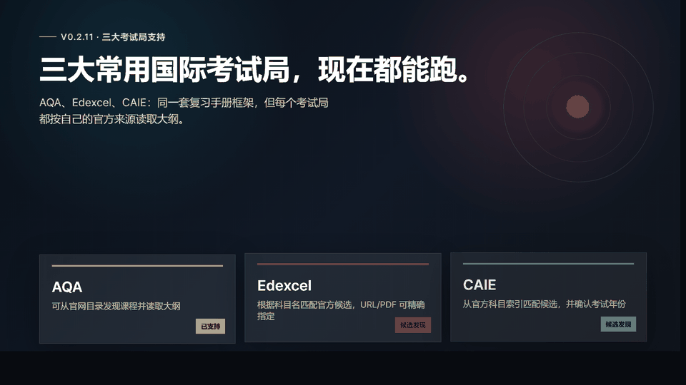

# IGCSE & A-Level AI Revision Guide Skill

<p align="center">
  
</p>

## 为什么要做这个 Skill

这个项目最早不是为了做一个“工具”，而是为了帮一个真实的孩子轻一点地走过转轨期。
我的儿子今年要参加 International GCSE 大考；他从公办体系转到国际课程还不到一年，
课堂语言几乎一下从全中文切换到全英文。知识点本身可以慢慢学，但新的语言、新的考试方式
和临近大考的时间压力叠在一起，很容易让孩子觉得自己被推着走。

我用 AI 做了一个学习、复习用的 Skill：让它围绕对应课程要求，把知识点拆成能理解的结构、
例题、图解和检查点。这个项目的初衷很简单：不是替孩子学习，而是把学习路上的噪音降下来，
利用人工智能帮助孩子更轻松、更有掌控感地面对学业。

<p align="center">
  <a href="https://mianbaofang.github.io/igcse-a-level-revision-guide/project-intro-animation.html">
    
  </a>
</p>

<p align="center">
  <a href="README.md">English</a>
  ·
  <a href="https://mianbaofang.github.io/igcse-a-level-revision-guide/">项目主页</a>
  ·
  <a href="https://mianbaofang.github.io/igcse-a-level-revision-guide/project-intro-animation.html">介绍动画</a>
  ·
  <a href="docs/HANDOFF.md">接手说明</a>
  ·
  <a href="docs/PROJECT_DETAILS.md">项目详情</a>
  ·
  <a href="docs/IMAGE_MODEL_GUIDE.md">生图建议</a>
</p>

一个给 AI Agent 使用的复习手册 Skill：输入国内常用三大国际考试局的科目要求，
生成图文并茂、可打印的 International GCSE / International AS-A-level 学习复习手册。

当前版本以三大考试局为基础设计：

| 考试局 | 当前支持方式 |
|---|---|
| AQA | 支持从官网科目目录发现课程，并读取公开大纲 PDF。 |
| Edexcel | 会先根据科目名尝试匹配官方候选页面；无法唯一确认时列出候选，也支持用户直接提供官方科目页或大纲 PDF。 |
| CAIE | 会从官方科目索引匹配候选；无法唯一确认时列出候选，也支持官方科目页或大纲 PDF；遇到多个考试年份时会先确认年份。 |

说明：文档和用户提示里优先使用国内更常见的简称 AQA、Edexcel、CAIE；对应全称分别是 OxfordAQA / Oxford International AQA、Pearson Edexcel、Cambridge International / CAIE。

这套流程面向三大考试局统一设计：先读取官方大纲，再生成知识点讲解、例题、图文学习单元、复习题和 PDF。

## 快速使用

普通用户不需要安装 Python，也不需要看懂代码。把下面这个 Skill 链接发给你的
OpenClaw、Hermes 或其他支持 Skill 的 Agent：

```text
https://github.com/mianbaofang/igcse-a-level-revision-guide/tree/main/skill
```

然后直接说：

```text
请安装这个 Skill，然后帮我生成 AQA Chemistry International GCSE 中文复习手册，并导出 PDF。
```

也可以这样说：

```text
帮我生成 Edexcel Accounting International GCSE 复习手册。
帮我生成 Cambridge IGCSE Economics 2027 考试用的中文学习手册。
帮我生成 AQA Mathematics 9260 复习手册，需要图文例题和最终复习题。
```

开始生成前，Agent 应先确认四件事：

1. 考试局、课程阶段、科目和代码，必要时确认官方链接。
2. 考试年份，尤其是 Cambridge 页面同时列出多个年份范围时。
3. 输出语言：中文或英文。手册正文、标签、例题和配图提示只使用一种语言。
4. 讲解风格：严谨、轻松、生活化、故事性、侦探推理、闯关式等。

注意：不需要在一开始选择生图模型。基础手册先生成，之后 Agent 会告诉你有多少张复杂信息图需要外部生成。
如果你有可调用的生图 API、Skill、脚本或已经生成好的图片目录，再让 Agent 导入或生成；如果没有，就使用 SVG 草图兜底，并提示复杂图需要复核。

## 会生成什么

每次生成会输出一个完整手册包：

```text
outputs/chemistry-9202/
  guide.html                 可预览、可打印的学习手册
  guide.pdf                  PDF 文件
  sections/                  分章节手册内容，便于 Agent 复查
  images/                    SVG 草图、信息图资产和配图清单
  run-options.json           本次确认的科目、语言和讲解风格
  guide-plan.json            知识点、例题和复习任务规划
  qualification.json         课程与来源信息
  validation.json            完整性检查结果
  handbook-package.json      最终交付清单
```

手册内容包括：

- 官方大纲整理出的知识点结构；
- 学生能读懂的讲解；
- 原创例题、步骤和答案检查点；
- 适合图文讲解的知识点与例题；
- 简单 SVG 图和复杂信息图需求清单；
- 最终备考复习题；
- 可打印 HTML/PDF。

## 效果预览

| Mathematics | Economics | Chemistry |
|---|---|---|
|  |  |  |

这些截图只是展示最终手册长什么样，不代表项目只支持这三门课。

## 三大考试局支持范围

| 考试局 | International GCSE | International AS-A-level | 当前说明 |
|---|---:|---:|---|
| AQA | 支持 | 支持 | 可从官网科目目录发现课程。 |
| Edexcel | 支持 | 支持 | 根据科目名匹配官方候选；多个候选时让用户选择；官方 URL/PDF 可作为精确输入。 |
| CAIE | 支持 | 支持 | 从官方科目索引匹配候选；多个候选时让用户选择；官方 URL/PDF 可作为精确输入；多年份页面会先确认考试年份。 |
| OCR、WJEC/Eduqas、CCEA 等其他英国考试局 | 暂不支持 | 暂不支持 | 不在当前版本范围内。 |

项目当前聚焦国内常用的 AQA、Edexcel 和 CAIE。
以后可以继续扩展，但不会把未支持的考试局写成已经支持。

## 图文与讲解风格

孩子愿意看的手册不能只有文字。生成流程会做两次判断：

1. 先根据官方大纲生成知识点、讲解和例题。
2. 再判断哪些知识点或例题需要图文结合讲解。

简单、可复现的结构图使用 SVG，例如概念地图、基础几何图、粒子示意图、流程图。
复杂内容先生成配图需求清单，例如实验装置、复杂几何、电路、经济学图表、带大量文字的信息图。

如果用户没有可调用的生图模型，图表、坐标轴、曲线、概率树、简单几何等可精确表达的内容会走脚本化科学矢量图 fallback：输出可编辑 SVG，并记录来源、标签和复核风险。它不替代复杂信息图；复杂信息图仍然等待外部模型或人工审核后的图片资产。

推荐的外部生图模型包括：

- OpenAI GPT Image 2.0；
- Qwen Image 2.0 Pro；
- SenseNova U1 Fast。

这些只是推荐选项，不代表每个用户都能直接调用。用户需要自己提供可用的 API、Skill、脚本或图片目录。
生图只负责解释已经选中的知识点，不能编造大纲里没有的考试结论。

讲解风格也可以选择：严谨备考、轻松愉快、生活场景、故事化、侦探推理、闯关式等。
默认使用原创表达，不复刻受保护角色或世界观。

## 语言策略

生成前必须选择一种输出语言：

- 选择中文，学生看到的正文、标签、例题和配图提示都用中文。
- 选择英文，学生看到的正文、标签、例题和配图提示都用英文。
- 不做中英拼接标签。
- 官方英文术语可以保留在来源文件或复核附录里，学生正文尽量保持单一语言。

## v0.2.6 更新了什么

v0.2.6 修正介绍动画导出尺寸和排版：README 里的 GIF 预览现在按完整的 1920x1080
动画舞台截图，覆盖完整 32 秒时间线，再缩放成标准 16:9 预览，不再被错误的截图窗口裁切。

## v0.2.5 更新了什么

v0.2.5 把介绍动画按 README 语言拆开：英文 README 使用英文动画和英文 GIF 预览，
中文 README 继续使用中文动画和中文 GIF 预览，避免说明页里中英文混在一起。

## v0.2.4 更新了什么

v0.2.4 修正介绍动画里的过时文案：动画现在按当前三大考试局支持方式描述，
即 AQA 官网目录发现、Edexcel 官方候选匹配、CAIE 官方科目索引候选匹配和考试年份确认。

## v0.2.3 更新了什么

v0.2.3 把 README 里的介绍动画预览补回来了：

- 在项目初衷下面放回可点击的 GIF 动画预览。
- 完整 HTML 动画仍然保留在项目主页里。

## v0.2.2 更新了什么

v0.2.2 是一次 Darwin 评审后的 Skill 指令质量更新：

- 增加清晰的 `STOP` / `CHECKPOINT` 门槛，避免还没确认科目、年份、语言、风格就开始生成。
- 明确 Edexcel/CAIE 如果出现多个官方候选，必须把候选返回给用户选择，不能猜。
- 说明 AQA 支持目录发现；Edexcel 和 CAIE 走官方 URL 优先 / 科目候选检查，不假装做全站爬虫。
- 明确候选检查生成的 scratch 手册不能当最终交付，选定官方路线后要按用户最终参数重新生成。

## v0.2.0 相比 v0.1.0 更新了什么

v0.1.0 主要围绕 AQA 的复习手册生成流程。v0.2.0 的重点是把项目升级成面向三大考试局的开源版本：

- 新增 Edexcel 官方候选发现，并保留官方 URL/PDF 精确输入。
- 新增 CAIE 官方科目索引候选发现，并保留官方 URL/PDF 输入与考试年份确认。
- 强化语言锁，避免生成内容一会儿中文、一会儿英文。
- 调整生图逻辑：不再开头询问具体模型，而是在基础手册生成后给出复杂信息图数量和配图需求。
- 增加 SVG 兜底和复杂图复核提示，避免把草图当成最终信息图。
- 补充跨科目回归样例，避免用某一门课的结构影响全部学科。
- 更新 GitHub 说明页、介绍动画和样例截图，让普通用户先看懂怎么用。

## 开发者快速开始

普通用户可以跳过这一节。只有想修改 Python 引擎或本地调试时才需要看。

```bash
python -m venv .venv
source .venv/bin/activate
pip install -e .
python -m intl_exam_guide generate --query chemistry --level igcse --language zh-CN --explanation-style friendly --out ./outputs/chemistry-9202
```

Windows PowerShell：

```powershell
python -m venv .venv
.\.venv\Scripts\Activate.ps1
pip install -e .
python -m intl_exam_guide generate --query chemistry --level igcse --language zh-CN --explanation-style friendly --out .\outputs\chemistry-9202
```

常用检查：

```bash
python -m pytest
python -m compileall -q src tests scripts
python scripts/scan_for_raw_keys.py .
```

## 目录结构

```text
src/intl_exam_guide/
  providers/      各考试局官方页面读取与解析
  parsing/        PDF 文本抽取
  planning/       知识点、例题和配图需求规划
  rendering/      HTML 与 PDF 渲染
  validation/     完整性检查
skill/            Agent 使用的 Skill 说明
docs/             项目详情、接手说明、准确性政策和展示页面
tests/            测试与回归样例
```

## 版权与来源

不要把下载的官方 PDF、past papers、mark schemes 或复制来的真题内容提交到仓库。
公开样例应使用原创讲解、原创练习卡和必要的来源信息。

给孩子正式备考使用前，建议由老师或熟悉大纲的人复核深度例题和答案。

## License

MIT.
