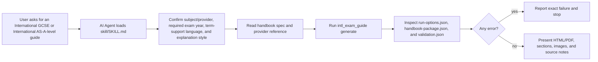
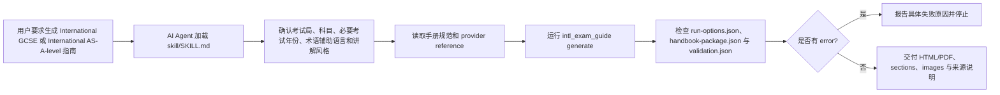

# Skill Explained / Skill 图解说明

<p align="center">
  
</p>

## English

The repository includes an AI Agent skill wrapper in `skill/`. The skill is designed
with progressive disclosure:

- `skill/SKILL.md` stays short and tells an agent when to use the tool.
- `skill/references/revision_guide_spec.md` stores the handbook output
  contract inherited from the original revision-guide Skill.
- `skill/references/oxfordaqa.md` stores AQA-specific provider notes; Edexcel
  and CAIE use the shared provider workflow and candidate-selection gates.
- The Python package performs deterministic work: discovery, PDF download,
  parsing, guide planning, visual-brief planning, rendering, packaging, and
  validation.

This keeps the agent from re-writing fragile scraping or rendering code every
time. The agent reads the skill, runs the CLI, and inspects `validation.json`
before reporting success.

## Skill Workflow



## Quality Gates

The skill treats a guide as incomplete unless all of these are true:

1. The source page URL is present.
2. The specification PDF URL is present.
3. The PDF SHA-256 hash is recorded.
4. Topics were extracted.
5. Every topic has an authored guide block.
6. Every topic has practice cards with command words, solution steps, and answer checkpoints.
7. HTML exists and contains required guide sections.
8. `sections/` and `images/` exist.
9. `run-options.json` records the confirmed subject, term-support language, optional
   image-provider metadata, and explanation style. The user is not asked to
   choose an image model before the base handbook exists.
10. PDF exists unless `--skip-pdf` was intentionally used.
11. `validation.json.review_summary` shows topic, diagram, practice-card, and
   source-snippet coverage.

For installation checks or CI demonstrations, run:

```bash
python -m intl_exam_guide demo --out ./outputs/demo-science --language en --image-provider deterministic-svg --explanation-style friendly --skip-pdf
```

## 中文

仓库内置 `skill/` 目录，用来作为 AI Agent skill。它遵循 progressive disclosure：

- `skill/SKILL.md` 保持简洁，只告诉 agent 什么时候使用、怎么运行。
- `skill/references/revision_guide_spec.md` 存放从原复习册 Skill 继承下来的
  手册交付标准。
- `skill/references/oxfordaqa.md` 存放 AQA 路线说明；Edexcel 和 CAIE 走共享
  provider 流程与候选确认门槛。
- Python 包负责稳定且容易出错的部分：发现页面、下载 PDF、解析、规划、
  图文需求分析、渲染、打包、校验。

这样做的好处是：agent 不需要每次重新写爬取和渲染代码，而是读取 skill、
运行 CLI、检查 `validation.json`，再决定能否交付。

## Skill 执行流程



## 质量门槛

除非满足以下条件，否则 skill 不应把指南当作完成品：

1. 有 source page URL。
2. 有 specification PDF URL。
3. 记录了 PDF SHA-256。
4. 成功抽取 topics。
5. 每个 topic 都有 guide block。
6. 每个 topic 都有练习卡片，并包含指令词、解题步骤和答案检查点。
7. HTML 存在，并包含必要 sections。
8. `sections/` 和 `images/` 存在。
9. `run-options.json` 记录用户确认的科目、术语辅助语言、讲解风格，以及可选的
   生图 provider 元数据；基础手册生成前不要求用户选择生图模型。
10. 除非明确使用 `--skip-pdf`，否则 PDF 必须存在。
11. `validation.json.review_summary` 显示 topic、diagram、practice card 和
   source snippet 覆盖度。
